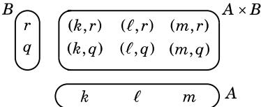
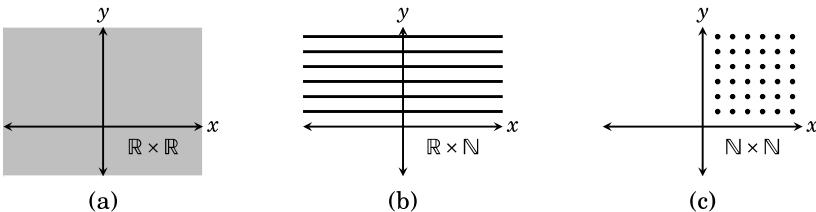
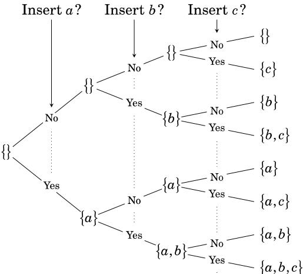

## Sets 

$\mathbf{A}^{\mathrm{i l}}$ of mathematics can be described with sets. This becomes more and more apparent the deeper into mathematics you go. It will be apparent in most of your upper level courses, and certainly in this course. The theory of sets is a language that is perfectly suited to describing and explaining all types of mathematical structures.

### 1.1 Introduction to Sets 

A set is a collection of things. The things are called elements of the set. We are mainly concerned with sets whose elements are mathematical entities,such as numbers, points, functions, etc.

A set is often expressed by listing its elements between commas, enclosed by braces. For example, the collection $\{2,4,6,8\}$ ·is a set which has four elements, the numbers 2,4,6 and 8. Some sets have infinitely many elements.For example, consider the collection of all integers,

$$\{\ldots,-4,-3,-2,-1,0,1,2,3,4,\ldots\}.$$

Here the dots indicate a pattern of numbers that continues forever in both the positive and negative directions. A set is called an infinite set if it has infinitely many elements; otherwise it is called a finite set.

Two sets are equal if they contain exactly the same elements. Thus $\left\{2,4,6,8\right\}=\left\{4,2,8,6\right\}$ ·because even though they are listed in a different order,the elements are identical; but $\left\{2,4,6,8\right\}\neq\left\{2,4,6,7\right\}$ . Also 

$$\{\dots-4,-3,-2,-1,0,1,2,3,4\dots\}=\{0,-1,1,-2,2,-3,3,-4,4,\dots\}.$$

We often let uppercase letters stand for sets. In discussing the set $\{2,4,6,8\}$ we might declare $A=\left\{2,4,6,8\right\}$ and then use A to stand for $\{2,4,6,8\}$ To express that 2 is an element of the set A, we write $2\in A$ ., and read this as $ \text{"}2$ _is an element $o f A,\mathrm{~o r~}^{\mathrm{~\scriptsize~\textcent~\textcent~\textcent~\textcent~\textcent~\textcent~\textcent~\textcent~\textcent~\textcent~\textcent~\textcent~\textcent~\textcent~\textcent~\textcent~\textcent~\textcent~\textcent~\textcent~\textcent~\textcent~\textcent~\textcent~\textcent~\textcent~\textcent~\textcent~\textcent~\textcent~\textcent~\textcent~\textcent~\textcent~\textcent~\textcent~\textcent~\textcent~\textcent~\textcent~\text~\textcent~\text~\text{~~}}}$ is in $A,$ or just $ \text{"}2in A.\text{"}$ We also have $4\in A,6\in A$ and $8\in A$ , but 5 A. We read this last expression as $ \text{"}5$ is not an element $o f$ $A,\mathrm{o r~}^{\mathrm{{\text--}}}5$ not in A." Expressions like $6,2\in A{\mathrm{~o r~}}2,4,8\in A$ . are used to indicate that several things are in a set.

Some sets are so significant that we reserve special symbols for them.The set of natural numbers (i.e., the positive whole numbers) is denoted by N, that is,

$$\mathbb{N}=\{1,2,3,4,5,6,7,\ldots\}.$$

The set of integers 

$$\mathbb{Z}=\left\{\dots,-3,-2,-1,0,1,2,3,4,\dots\right\}$$

is another fundamental set. The symbol R stands for the set of all real numbers, a set that is undoubtedly familiar to you from calculus. Other special sets will be listed later in this section.

Sets need not have just numbers as elements. The set $B=\left\{\boldsymbol{T},\boldsymbol{F}\right\}$ consists of two letters, perhaps representing the values "true" and "false." The set $C=\{a,e,i,o,u\}$ consists of the lowercase vowels in the English alphabet.The set $D=\left\{(0,0),(1,0),(0,1),(1,1)\right\}$ · has as elements the four corner points of a square on the $x=y$ coordinate plane. Thus $(0,0)\in D,\;(1,0)\in D$ ,etc.,but $(1,2)\notin D$ (for instance). It is even possible for a set to have other sets as elements. Consider $E=\left\{1,\{2,3\},\{2,4\}\right\}$ , which has three elements: the number 1, the set $\{2,3\}$ and the set $\{2,4\}$ . Thus $1\in E$ and $\{2,3\}\in E$ and $\{2,4\}\in E$ '. But note that $2\notin E,3\notin E$ and $4\notin E$ 

Consider the set $M=\left\{\left[00\right],\left[10\right],\left[10\right]\right\}$ of three two-by-two matrices. We have $\left[{0\atop00}\right]\in M$ ,but $\left[{1\atop0}\right.{1\atop1}\left]\not\in\widetilde{M}$ . Letters can serve as symbols denoting a set's elements:$\mathrm{If}a=\left[\widehat{00}\right],b=\left[\widehat{10}\right]\mathrm{and}c=\left[\widehat{10}\right],\mathrm{then}M=\{a,b,c\}$ 

If X is a finite set, its cardinality or size is the number of elements it has, and this number is denoted as $|X|$ . Thus for the sets above,$|A|=4$ ,

$|B|=2,|C|=5,|D|=4,|E|=3\ and\ |M|=3$ 

There is a special set that, although small, plays a big role. The empty set is the set $\{\}$ that has no elements. We denote it as $\varnothing.$ , so $\varnothing=\left\{\begin{array}{l l}{\end{array}\right\}$ . Whenever you see the symbol , it stands for $\{\}$ . Observe that $|\boldsymbol{\emptyset}|=0$ . The empty set is the only set whose cardinality is zero.

Be careful in writing the empty set. Don't write $\{\phi\}$ when you mean φ.These sets can't be equal because φ contains nothing while $\{\phi\}$ ·contains one thing, namely the empty set. If this is confusing, think of a set as a box with things in it, so, for example,$\left\{2,4,6,8\right\}$ is a $\mathrm{{``b o x''}}$ containing four numbers. The empty set $\varnothing=\left\{\begin{array}{r l}\end{array}\right.$ is an empty box. By contrast,$\{\phi\}$ is a box with an empty box inside it. Obviously, there's a difference: An empty box is not the same as a box with an empty box inside it. Thus $\varnothing\neq\left\{\varnothing\right\}$  (You might also note $|\phi|=0and\left|\{\phi\}\right|=1$ as additional evidence that $\begin{array}{r}{\emptyset\neq\{\emptyset\}.}\end{array}$ 

This box analogy can help us think about sets. The set $\boldsymbol{F}=\left\{\boldsymbol{\emptyset},\left\{\boldsymbol{\emptyset}\right\},\left\{\left\{\boldsymbol{\emptyset}\right\}\right\}\right\}$ may look strange but it is really very simple. Think of it as a box containing three things: an empty box, a box containing an empty box, and a box containing a box containing an empty box. Thus $|\pmb{F}|=3$ . The set $G=\left\{\mathbb{N},\mathbb{Z}\right\}$ is a box containing two boxes, the box of natural numbers and the box of integers. Thus $|G|=2$ 

A special notation called set-builder notation is used to describe sets that are too big or complex to list between braces. Consider the infinite set of even integers $E=\left\{\ldots,-6,-4,-2,0,2,4,6,\ldots\right\}$ . In set-builder notation this set is written as 

$$E=\{2n:n\in\mathbb{Z}\}.$$

We read the first brace as $ \text{"}t h e\text{"}$ set of all things of form," and the colon as "such that." So the expression $E=\left\{2n:n\in\mathbb{Z}\right\}$ reads as $\mathbf{\nabla}^{\mathbf{\nabla}}E$ equals the set of all things of form $2n$ , such that n is an element $o f\mathbb{Z}.$ The idea is that E consists of all possible values of $2n$ , where n takes on all values in Z.

In general, a set X written with set-builder notation has the syntax 

$$X=\{\mathrm{e x p r e s s i o n:r u l e}\},$$

where the elements of X are understood to be all values of "expression" that are specified by "rule." For example, above E is the set of all values of the expression $2n$ that satisfy the rule $n\in\mathbb{Z}$ . There can be many ways to express the same set. For example,$E=\left\{2n:n\in\mathbb{Z}\right\}=\left\{n:n\right.$ is an even $\mathbf{i n t e g e r}\}=$ :$\left\{n:n=2k,k\in\mathbb{Z}\right\}$ . Another common way of writing it is 

$$E=\{n\in\mathbb{Z}:n is even\},$$

read $ ``E$ is the set of all n in Z such that n is even." Some writers use a bar instead of a colon; for example,$E=\{n\in\mathbb{Z}|n$ is even}. We use the colon.

Example 1.1 Here are some further illustrations of set-builder notation.

$$\begin{aligned}1.\quad&\left\{n:n is a prime number\right\}=\left\{2,3,5,7,11,13,17,\ldots\right\}\\2.\quad&\left\{n:n is prime\right\}=\left\{2,3,5,7,11,13,17,\ldots\right\}\\3.\quad&\left\{n^2:n\in\mathbb{Z}\right\}=\left\{0,1,4,9,16,25,\ldots\right\}\\4.\quad&\left\{x\in\mathbb{R}:x^2-2=0\right\}=\left\{\sqrt{2},-\sqrt{2}\right\}\\5.\quad&\left\{x\in\mathbb{Z}:x^2-2=0\right\}=\emptyset\\6.\quad&\left\{x\in\mathbb{Z}:|x|<4\right\}=\left\{-3,-2,-1,0,1,2,3\right\}\\7.\quad&\left\{2x:x\in\mathbb{Z},|x|<4\right\}=\left\{-6,-4,-2,0,2,4,6\right\}\\8.\quad&\left\{x\in\mathbb{Z}:|2x|<4\right\}=\left\{-1,0,1\right\}\end{aligned}$$

Items 6-8 above highlight a conflict of notation that we must always be alert to. The expression |X means absolute value if X is a number and cardinality if X is a set. The distinction should always be clear from context. Consider $\left\{x\in\mathbb{Z}:|x|<4\right\}$ in Example 1.1 (6) above. Here $x\in\mathbb{Z}$ ,sox is a number (not a set), and thus the bars in |xl must mean absolute value,not cardinality. On the other hand, suppose $A=\left\{\{\mathbf{1},\mathbf{2}\},\{\mathbf{3},\mathbf{4},\mathbf{5},\mathbf{6}\},\{\mathbf{7}\}\right\}$ and $B=\left\{X\in A:|X|<3\right\}$ . The elements of A are sets (not numbers), so the |X| in the expression for B must mean cardinality. Therefore $B=\left\{\{1,2\},\{7\}\right\}$ 

Example 1.2 Describe the set $A=\left\{7a+3b:a,b\in\mathbb{Z}\right\}$ 

Solution: This set contains all numbers of form $7a+3b$ , where a and b are integers. Each such number $7a+3b$ is an integer, so A contains only integers. But which integers? If n is any integer, then $n=7n+3(-2n)$ 1, so $n=7a+3b$ where $a=n and b=-2n$ .. Therefore $n\in A$ . We've now shown that A contains only integers, and also that every integer is an element of A.Consequently $A=\mathbb{Z}$ 

We close this section with a summary of special sets. These are sets that are so common that they are given special names and symbols.

The empty set:$\varnothing=\left\{\begin{array}{r l}\end{array}\right.$ 

The natural numbers:$\mathbb{N}=\left\{1,2,3,4,5,\ldots\right\}$ 

The integers:$\mathbb{Z}=\left\{\ldots,-3,-2,-1,0,1,2,3,4,5,\ldots\right\}$ 

The rational numbers:$\mathbb{Q}=\left\{x:x={\frac{m}{n}}\right.$ ,where $m,n\in\mathbb{Z}{\mathrm{~a n d~}}n\neq0{\Big\}}$ 

The real numbers: R 

We visualize the set R of real numbers as an infinitely long number line.

$$\begin{array}{r}{\xrightarrow{-4\quad-3\quad-2\quad-1\quad0\quad1\quad2\quad3\quad4}}\\ {\xleftarrow{\quad\quad\quad\quad\quad\quad\quad\quad\quad\quad\quad\quad\quad\quad\quad\quad\quad\quad\quad\quad\quad\quad\quad\quad\quad\quad\quad\quad}}\end{array}$$

Notice that  is the set of all numbers in R that can be expressed as a fraction of two integers. You may be aware that $\mathbb{Q}\neq\mathbb{R},\mathrm{a s}\sqrt{2}\notin\mathbb{Q}$ but ${\sqrt{2}}\in\mathbb{R}$ (If not, this point will be addressed in Chapter 6.)

In calculus you encountered intervals on the number line. Like R, these too are infinite sets of numbers. Any two numbers a.$,b\in\mathbb{R}with a<b$ give rise to various intervals. Graphically, they are represented by a darkened segment on the number line between a and b.A solid circle at an endpoint indicates that that number is included in the interval. A hollow circle indicates a point that is not included in the interval.

a b Closed interval:$\left[a,b\right]=\left\{x\in\mathbb{R}:a\leq x\leq b\right\}$ 。Open interval:$\left(a,b\right)=\left\{x\in\mathbb{R}:a<x<b\right\}$ $a$c 。a b Half-open interval:$\left(a,b\right]=\left\{x\in\mathbb{R}:a<x\leq b\right\}$ 

a b Half-open interval:$\left[a,b\right)=\left\{x\in\mathbb{R}:a\leq x<b\right\}$ 。Infinite interval:$\left(a,\infty\right)=\left\{x\in\mathbb{R}:a<x\right\}$ ao Infinite interval:$\left[a,\infty\right)=\left\{x\in\mathbb{R}:a\leq x\right\}$ a 

b Infinite interval:$\left(-\infty,b\right)=\left\{x\in\mathbb{R}:x<b\right\}$ 。

b Infinite interval:$\left(-\infty,b\right]=\left\{x\in\mathbb{R}:x\leq b\right\}$ 

Each of these intervals is an infinite set containing infinitely many numbers as elements. For example, though its length is short, the interval (0.1,0.2) contains infinitely many numbers, that is, all numbers between 0.1 and 0.2. It is an unfortunate notational accident that (a,b) can denote both an open interval on the line and a point on the plane. The difference is usually clear from context. In the next section we will see yet another meaning of $(a,b)$ .

### Exercises for Section 1.1

A. Write each of the following sets by listing their elements between braces.

1.2.7.8.4.5.6.$\left\{5x-1:x\in\mathbb{Z}\right\}$ $\left\{x\in\mathbb{R}:x^{2}+5x=-6\right\}$ $\left\{x\in\mathbb{R}:x^{3}+5x^{2}=-6x\right\}$ $\left\{x\in\mathbb{R}:x^{2}=9\right\}$ $\left\{x\in\mathbb{R}:x^{2}=3\right\}$ $\left\{x\in\mathbb{Z}:-2\leq x<7\right\}$ $\left\{3x+2:x\in\mathbb{Z}\right\}$ $\left\{x\in\mathbb{N}:-2<x\leq7\right\}$ $\left\{x\in\mathbb{R}:x^{2}+5x=-6\right\}$ $\left\{x\in\mathbb{R}:x^{3}+5x^{2}=-6x\right\}$ $\begin{aligned}&9.\left\{x\in\mathbb{R}:\sin\pi x=0\right\}\\&10.\left\{x\in\mathbb{R}:\cos x=1\right\}\\&11.\left\{x\in\mathbb{Z}:|x|<5\right\}\\&12.\left\{x\in\mathbb{Z}:|2x|<5\right\}\\&13.\left\{x\in\mathbb{Z}:|6x|<5\right\}\\&14.\left\{5x:x\in\mathbb{Z},|2x|\leq8\right\}\\&15.\left\{5a+2b:a,b\in\mathbb{Z}\right\}\\&16.\left\{6a+2b:a,b\in\mathbb{Z}\right\}\end{aligned}$ 

B. Write each of the following sets in set-builder notation.

$\begin{array}{r l}&{\mathbf{17.}\{2,4,8,16,32,64,\dots\}}\\ &{\mathbf{18.}\{0,4,16,36,64,100,\dots\}}\\ &{\mathbf{19.}\{\dots,-6,-3,0,3,6,9,12,15,\dots\}}\\ &{\mathbf{20.}\{\dots,-8,-3,2,7,12,17,\dots\}}\\ &{\mathbf{21.}\{0,1,4,9,16,25,36,\dots\}}\\ &{\mathbf{22.}\{3,6,11,18,27,38,\dots\}}\end{array}$ $\begin{array}{r l}&{\mathbf{23.}\{3,4,5,6,7,8\}}\\ &{\mathbf{24.}\{-4,-3,-2,-1,0,1,2\}}\\ &{\mathbf{25.}\{\dots,\frac{1}{8},\frac{1}{4},\frac{1}{2},1,2,4,8,\dots\}}\\ &{\mathbf{26.}\{\dots,\frac{1}{27},\frac{1}{9},\frac{1}{3},1,3,9,27,\dots\}}\\ &{\mathbf{27.}\{\dots,-\pi,-\frac{\pi}{2},0,\frac{\pi}{2},\pi,\frac{3\pi}{2},2\pi,\frac{5\pi}{2},\dots\}}\\ &{\mathbf{28.}\{\dots,-\frac{3}{2},-\frac{3}{4},0,\frac{3}{4},\frac{3}{2},\frac{9}{4},3,\frac{15}{4},\frac{9}{2},\dots\}.}\end{array}$ 

C. Find the following cardinalities.

$\begin{array}{r l}&{\mathbf{29.}\quad\big|\big\{\{1\},\big\{2,\{3,4\}\},\emptyset\big\}\big|}\\ &{\mathbf{30.}\quad\big|\big\{\{1,4\},a,b,\big\{\{3,4\}\},\{\emptyset\big\}\big\}\big|}\\ &{\mathbf{31.}\quad\big|\big\{\{1\},\big\{2,\{3,4\}\},\emptyset\big\}\big\}\big|}\\ &{\mathbf{32.}\quad\big|\big\{\{\{1,4\},a,b,\big\{\{3,4\}\},\{\emptyset\big\}\big\}\big\}\big|}\\ &{\mathbf{33.}\quad\big|\big\{x\in\mathbb{Z}:|x|<10\big\}\big|}\end{array}$ $\begin{aligned}&34\text{.}\left|\left\{x\in\mathbb{N}:|x|<10\right\}\right|\\&35\text{.}\left|\left\{x\in\mathbb{Z}:x^{2}<10\right\}\right|\\&36\text{.}\left|\left\{x\in\mathbb{N}:x^{2}<10\right\}\right|\\&37\text{.}\left|\left\{x\in\mathbb{N}:x^{2}<0\right\}\right|\\&38\text{.}\left|\left\{x\in\mathbb{N}:5x\leq20\right\}\right|\end{aligned}$ 

D.Sketch the following sets of points in the x-y plane.

$\begin{aligned}&\mathbf{39.}\left\{(x,y):x\in[1,2],y\in[1,2]\right\}\quad&\mathbf{46.}\left\{(x,y):x,y\in\mathbb{R},x^{2}+y^{2}\leq1\right\}\\&\mathbf{40.}\left\{(x,y):x\in[0,1],y\in[1,2]\right\}\quad&\mathbf{47.}\left\{(x,y):x,y\in\mathbb{R},y\geq x^{2}-1\right\}\\&\mathbf{41.}\left\{(x,y):x\in[-1,1],y=1\right\}\quad&\mathbf{48.}\left\{(x,y):x,y\in\mathbb{R},x>1\right\}\\&\mathbf{42.}\left\{(x,y):x=2,y\in[0,1]\right\}\quad&\mathbf{49.}\left\{(x,x+y):x\in\mathbb{R},y\in\mathbb{Z}\right\}\\&\mathbf{43.}\left\{(x,y):|x|=2,y\in[0,1]\right\}\quad&\mathbf{50.}\left\{(x,\frac{x^{2}}{y}):x\in\mathbb{R},y\in\mathbb{N}\right\}\\&\mathbf{44.}\left\{(x,x^{2}):x\in\mathbb{R}\right\}\quad&\mathbf{51.}\left\{(x,y)\in\mathbb{R}^{2}:(y-x)(y+x)=0\right\}\\&\mathbf{45.}\left\{(x,y):x,y\in\mathbb{R},x^{2}+y^{2}=1\right\}\quad&\mathbf{52.}\left\{(x,y)\in\mathbb{R}^{2}:(y-x^{2})(y+x^{2})=0\right\}\end{aligned}$ 

### 1.2 The Cartesian Product 

Given two sets A and B, it is possible to "multiply" them to produce a new set denoted as $A\times B$ . This operation is called the Cartesian product. To understand it, we must first understand the idea of an ordered pair.

Definition 1.1 An ordered pair is a list $(x,y)$ of two things x and ,enclosed in parentheses and separated by a comma.

For example, (2,4) is an ordered pair, as is (4,2). These ordered pairs are different because even though they have the same things in them, the order is different. We write $(2,4)\neq(4,2)$ . Right away you can see that ordered pairs can be used to describe points on the plane, as was done in calculus, but they are not limited to just that. The things in an ordered pair don't have to be numbers. You can have ordered pairs of letters, such as $(\ell,m)$ ,ordered pairs of sets such as $\left(\{2,5\},\{3,2\}\right)$ ), even ordered pairs of ordered pairs like $\left((\mathrm{2},\mathrm{4}),(\mathrm{4},\mathrm{2})\right)$ .The following are also ordered pairs: (2,{1,2,3}), (R,(0,0)). Any list of two things enclosed by parentheses is an ordered pair. Now we are ready to define the Cartesian product.

Definition 1.2 The Cartesian product of two sets A and B is another set, denoted as $A\times B$ and defined as $A\times B=\left\{(a,b):a\in A,b\in B\right\}$ 

Thus $A\times B$ is a set of ordered pairs of elements from A and B. For example, if $A=\left\{k,\ell,m\right\}$ and $B=\left\{q,r\right\}$ ,then 

$$A\times B=\left\{(k,q),(k,r),(\ell,q),(\ell,r),(m,q),(m,r)\right\}.$$

Figure 1.1 shows how to make a schematic diagram of $A\times B$ . Line up the elements of A horizontally and line up the elements of B vertically, as if A and B form an x- and y-axis. Then fill in the ordered pairs so that each element $(x,y)$ is in the column headed by x and the row headed by y.

Figure 1.1. A diagram of a Cartesian product 

For another example,$\left\{0,1\right\}\times\left\{2,1\right\}=\left\{(0,2),(0,1),(1,2),(1,1)\right\}$ .. If you are a visual thinker, you may wish to draw a diagram similar to Figure 1.1. The rectangular array of such diagrams give us the following general fact.

Fact 1.1If A and B are finite sets, then $|A\times B|=|A|\cdot|B|$ 

Example 1.3 Let $A=\{\square,\square,\square,\square,\square,\square,\square\}$ - be the set consisting of the six faces of a dice. The Cartesian product $A\times A$ is diagramed below. By Fact 1.1 (or by simple counting),$|A\times A|=6\cdot6=36$ . We might think of $A\times A$ as the set of possible outcomes in rolling a dice two times in a row. Each element of the product is an ordered pair of form (result of 1st roll, result of 2nd roll).Such constructions are useful in the study of probability.

$$A\times A $$

The set $\mathbb{R}\times\mathbb{R}=\{(x,y):x,y\in\mathbb{R}\}$ should be very familiar. It can be viewed as the set of points on the Cartesian plane, as drawn in Figure 1.2(a). The set $\mathbb{R}\times\mathbb{N}=\left\{\left(x,y\right):x\in\mathbb{R},y\in\mathbb{N}\right\}$ can be regarded as all of the points on the plane whose second coordinate is a natural number. This is illustrated in Figure 1.2(b), which shows that $\mathbb{R}\times\mathbb{N}$ looks like infinitely many horizontal lines at integer heights above the $x{\tt-a x i s}$ . The set $\mathbb{N}\times\mathbb{N}$ is the set of all points on the plane whose coordinates are both natural numbers. It looks like a grid of dots in the first quadrant, as illustrated in Figure 1.2(c).

Figure 1.2. Drawings of some Cartesian products 

It is even possible for one factor of a Cartesian product to be a Cartesian product itself, as in $\mathbb{R}\times(\mathbb{N}\times\mathbb{Z})=\{(x,(y,z)):x\in\mathbb{R},(y,z)\in\mathbb{N}\times\mathbb{Z}\}$ 

We can also define Cartesian products of three or more sets by moving beyond ordered pairs. An ordered triple is a list $(x,y,z)$ . The Cartesian product of the three sets R, N and Z is R $\times\mathbb{N}\times\mathbb{Z}=\left\{(x,y,z):x\in\mathbb{R},y\in\mathbb{N},z\in\mathbb{Z}\right\}$ Of course there is no reason to stop with ordered triples. In general,

$$A_{1}\times A_{2}\times\cdots\times A_{n}=\{(x_{1},x_{2},\ldots,x_{n}):x_{i}\in A_{i}{\mathrm{~f o r~e a c h~}}i=1,2,\ldots,n\}.$$

Be mindful of parentheses. There is a slight difference between $\mathbb{R}\times(\mathbb{N}\times\mathbb{Z})$ and $\mathbb{R}\times\mathbb{N}\times\mathbb{Z}$ . The first is a Cartesian product of two sets; its elements are ordered pairs $(x,(y,z))$ 1. The second is a Cartesian product of three sets; its elements are ordered triples $(x,y,z)$ . To be sure, in many situations there is no harm in blurring the distinction between expressions like $(x,(y,z))$ and $(x,y,z)$ , but for now we regard them as different.

For any set A and positive integer $n$ , the Cartesian power $A^{n}$ is 

$$A^{n}=A\times A\times\cdots\times A=\left\{\left(x_{1},x_{2},\ldots,x_{n}\right):x_{1},x_{2},\ldots,x_{n}\in A\right\}.$$

In this way,$\mathbb{R}^{2}$ is the familiar Cartesian plane and $\mathbb{R}^{3}$ is three-dimensional space. You can visualize how, if $\mathbb{R}^{2}$ is the plane, then $\mathbb{Z}^{2}=\left\{(m,n):m,n\in\mathbb{Z}\right\}$ is a grid of points on the plane. Likewise, as $\mathbb{R}^{3}$ is 3-dimensional space,$\mathbb{Z}^{3}=\left\{(m,n,p):m,n,p\in\mathbb{Z}\right\}$ is a grid of points in space.

In other courses you may encounter sets that are very similar to $\mathbb{R}^{n}$ ,but yet have slightly different shades of meaning. Consider, for example, the set of all two-by-three matrices with entries from R:

$$M=\left\{\left[{u\atop x}{v\atop y}{w\atop z}\right]:u,v,w,x,y,z\in\mathbb{R}\right\}.$$

This is not really all that different from the set 

$$\mathbb{R}^{6}=\left\{(u,v,w,x,y,z):u,v,w,x,y,z\in\mathbb{R}\right\}.$$

The elements of these sets are merely certain arrangements of six real numbers. Despite their similarity, we maintain that $M\neq\mathbb{R}^{6}$ ,for two-bythree matrices are not the same things as sequences of six numbers.

Example 1.4 Represent the two sides of a coin by the set $S=\left\{\scriptstyle\mathrm{H},\scriptstyle\mathrm{T}\right\}$ . The possible outcomes of tossing the coin seven times in a row can be described with the Cartesian power $S^{7}$ . A typical element of $S^{7}$ looks like 

$$(\scriptstyle{\mathrm{H}},\scriptstyle{\mathrm{H}},\scriptstyle{\mathrm{T}},\scriptstyle{\mathrm{H}},\scriptstyle{\mathrm{T}},\scriptstyle{\mathrm{T}},\scriptstyle{\mathrm{T}}),$$

meaning a head was tossed first, then another head, then a tail, then a head followed by three tails. Note that $\left|S^{7}\right|=2^{7}=128$ ,so there are 128 possible outcomes. If this is not clear, then it will be explained fully in Chapter 3.

### Exercises for Section 1.2

A. Write out the indicated sets by listing their elements between braces.
1. Suppose $A=\left\{1,2,3,4\right\}$ and $B=\{a,c\}$ 

(a)$A\times B$ (c)$A\times A$ (e)$\boldsymbol{\emptyset}\times\boldsymbol{B}$ (g)$A\times(B\times B)$ 
(b)$B\times A$ (d)$B\times B$ (f)$(A\times B)\times B$ (h)$B^{3}$ 
2. Suppose $A=\{\pi,e,0\}\mathrm{a n d}B=\{0,1\}$ 

(a)$A\times B$ (c)$A\times A$ (e)$A\times\emptyset$ (g)$A\times(B\times B)$ 
(b)$B\times A$ (d)$B\times B$ (f)$(A\times B)\times B$ (h)$A\times B\times B$ 
3.$\left\{x\in\mathbb{R}:x^{2}=2\right\}\times\left\{a,c,e\right\}$ 6.$\left\{x\in\mathbb{R}:x^{2}=x\right\}\times\left\{x\in\mathbb{N}:x^{2}=x\right\}$ 
4.$\left\{n\in\mathbb{Z}:2<n<5\right\}\times\left\{n\in\mathbb{Z}:|n|=5\right\}$ 7.$\left\{\varnothing\right\}\times\left\{0,\varnothing\right\}\times\left\{0,1\right\}$ 
5.$\left\{x\in\mathbb{R}:x^{2}=2\right\}\times\left\{x\in\mathbb{R}:|x|=2\right\}$ 8.$\left\{0,1\right\}^{4}$ 

B. Sketch these Cartesian products on the $x–y$ plane $\mathbb{R}^{2}\:(\mathbf{o r}\:\mathbb{R}^{3}$ for the last two).
$\begin{array}{r l}&{\mathbf{9.}\left\{1,2,3\right\}\times\left\{-1,0,1\right\}}\\ &{\mathbf{10.}\left\{-1,0,1\right\}\times\left\{1,2,3\right\}}\\ &{\mathbf{11.}\left[0,1\right]\times\left[0,1\right]}\\ &{\mathbf{12.}\left[-1,1\right]\times\left[1,2\right]}\\ &{\mathbf{13.}\left\{1,1.5,2\right\}\times\left[1,2\right]}\\ &{\mathbf{14.}\left[1,2\right]\times\left\{1,1.5,2\right\}}\end{array}$ 18.19.17.$\left\{(x,y)\in\mathbb{R}^{2}:x^{2}+y^{2}\leq1\right\}\times[0,1]$ $\mathbb{N}\times\mathbb{Z}$ $\mathbb{N}\times\mathbb{Z}$ $\mathbb{Z}\times\mathbb{Z}$ $[0,1]\times[0,1]\times[0,1]$ $[0,1]\times\left\{1\right\}$ $\left\{1\right\}\times\left[0,1\right]$ $\left\{(x,y)\in\mathbb{R}^{2}:x^{2}+y^{2}\leq1\right\}\times[0,1]$ $[0,1]\times[0,1]\times[0,1]$ 

### 1.3 Subsets 

It can happen that every element of a set A is an element of another set B.For example, each element of $A=\left\{0,2,4\right\}$ is also an element of $B=\{0,1,2,3,4\}$ When A and B are related this way we say that A is a subset $o f B$ 

Definition 1.3 Suppose A and B are sets. If every element of A is also an element of B, then we say A is a subset of B,and we denote this as $A\subseteq B$ . We write $A\not\subseteq B$ if A is not a subset of B,that is, if it is not true that every element of A is also an element of B. Thus $A\not\subseteq B$ means that there is at least one element of A that is not an element of B.

Example 1.5 Be sure you understand why each of the following is true.

1.$\left\{2,3,7\right\}\subseteq\left\{2,3,4,5,6,7\right\}$ 

2.$\left\{2,3,7\right\}\not\subseteq\left\{2,4,5,6,7\right\}$ 

3.$\left\{2,3,7\right\}\subseteq\left\{2,3,7\right\}$ 

4.$\left\{\left(x,\sin(x)\right):x\in\mathbb{R}\right\}\subseteq\mathbb{R}^{2}$ 

5.$\left\{1,3,5,7,11,13,17,\ldots\right\}{\subseteq}\mathbb{N}$ 

6.$\mathbb{N}\subseteq\mathbb{Z}\subseteq\mathbb{Q}\subseteq\mathbb{R}$ 

7.$\mathbb{R}\times\mathbb{N}\subseteq\mathbb{R}\times\mathbb{R}$ 

8.$A\subseteq A$ for any set A 9.$\emptyset\subseteq\emptyset$ 

This brings us to a significant fact: If B is any set whatsoever, then .$\varnothing\subseteq B$ To see why this is true, look at the last sentence of Definition 1.3. It says that $\varnothing\not\subseteq B$ would mean that there is at least one element of φ that is not an element of B. But this cannot be so because φ contains no elements! Thus it is not the case that $\varnothing\not\subseteq B$ ,so it must be that.$\varnothing\subseteq B$ 

Fact 1.2 The empty set is a subset of all sets, that is,$\emptyset\subseteq B$ for any set B.

Here is another way to look at it. Imagine a subset of B as a thing you make by starting with braces {}, then filling them with selections from B.For example, to make one particular subset of $B=\left\{a,b,c\right\}$ ,start with {},select b and c from B and insert them into $\{\}$ to form the subset $\left\{b,c\right\}$ Alternatively, you could have chosen just a to make $\left\{a\right\}$ ,and so on. But one option is to simply select nothing from B. This leaves you with the subset {}.Thus $\left\{\right\}{\subseteq}B$ .More often we write it as.$\emptyset\subseteq B$ 

This idea of "making"a subset can help us list out all the subsets of a given set B. As an example, let $B=\left\{a,b,c\right\}$ . Let's list all of its subsets. One way of approaching this is to make a tree-like structure. Begin with the subset $\{\}$ ,which is shown on the left of Figure 1.3. Considering the element  of $B$ , we have a choice: insert it into $\{\}$ ,or not. The lines from $\{\}$ point to what we get depending whether or not we insert $a,$ ,either $\left\{\begin{array}{l l}{\mathbf{o r}\left\{a\right\}}\end{array}\right.$ .Now move on to the element b of B. For each of the sets just formed we can either insert or not insert $b$ , and the lines on the diagram point to the resulting sets $\{\},\{b\},\{a\},\mathrm{o r}\{a,b\}$ . Finally, to each of these sets, we can either insert c or not insert it, and this gives us, on the far right-hand column, the sets {}，,$\{c\}$ ，{b},$\{b,c\}$ $\left\{a\right\}$ ,$\{a,c\}$ $\left\{a,b\right\}$ and $\{a,b,c\}$ . These are the eight subsets of $B=\{a,b,c\}$ 

Figure 1.3. A "tree" for listing subsets 

We can see from the way this tree branches that if it happened that $B=\{a\}$ , then B would have just two subsets, those in the second column of the diagram. If it happened that $B=\{a,b\}$ ,then B would have four subsets,those in the third column, and so on. At each branching of the tree, the number of subsets doubles. So in general, if $|B|=n$ , then B has $2^{n}$ subsets.

Fact 1.3 If a finite set has n elements, then it has $2^{n}$ subsets.